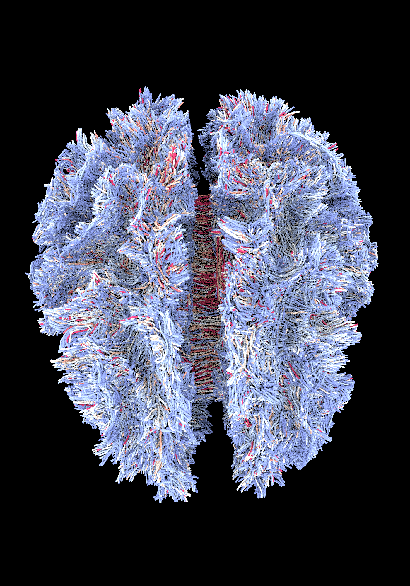

# Ascent + ANARI InSitu Visualization Integrations

Create a build directory:
```bash
ROOT=$PWD # or where you want to build
mkdir build
```

## Dependencies

* Python

* On NVIDIA GPU, you need to install CUDA and [OptiX](https://developer.nvidia.com/rtx/ray-tracing/optix) 7+.

    And export the path to OptiX:
    ```bash
    # Linux (Bash)
    export OptiX_INSTALL_DIR="/media/data/qadwu/Software/NVIDIA-OptiX-SDK-7.4.0-linux64-x86_64"
    ```
    ```powershell
    # Windows (Powershell)
    $Env:OptiX_INSTALL_DIR = "C:\ProgramData\NVIDIA Corporation\OptiX SDK 7.4.0"
    ```

## Build Everything

The work directory is the root directory of this repository.
```bash
cd <root-directory>
```

### Build Dependencies

Linux
```bash
cmake -S superbuild -B build/deps -DBUILD_VTKM=ON
```

Windows (Assume you have Visual Studio 2022 installed, if not, change the generator to the one you have)
```powershell
cmake -S superbuild -B build/deps -G "Visual Studio 17 2022" -A x64 -DBUILD_VTKM=ON
```

Then, for all platforms:
```bash
cmake --build build/deps --config Release --parallel
```

Outputs are installed into `build/install`.


### Actual Compilation

Linux
```bash
cd build
cmake -S . -B build -DCMAKE_PREFIX_PATH="build\deps\install"
```

Windows (Assume you have Visual Studio 2022 installed, if not, change the generator to the one you have)
```powershell
cd build
cmake -S . -B build -G "Visual Studio 17 2022" -A x64 -DCMAKE_PREFIX_PATH="build\deps\install"
```


Then, for all platforms:
```bash
cmake --build build --config Release --parallel
```

## Tutorials

### Tutorial 1: anariTutorialCpp

Linux:
```bash
./build/deps/anari/build/anariTutorialCpp
```

Windows:
```powershell
.\build\deps\anari\build\Release\anariTutorialCpp.exe
```


### Tutorial 1.1: demoFiberTracks

Linux:
```bash
./build/demoFiberTracks BrainFiber_ExampleData/FiberTracts/DTI_processed_ACT_5TTwmmask_seedgmwmi_0.5M_sift0.1M.vtk
```



### Tutorial 2: anariViewer

Linux:

```bash
export LD_LIBRARY_PATH=${PWD}/build/deps/install/lib:$LD_LIBRARY_PATH

cd 
ANARI_LIBRARY=helide ./build/deps/anari/build/anariViewer 
# require libanari_library_ospray.so
ANARI_LIBRARY=ospray ./build/deps/anari/build/anariViewer 
# require libanari_library_barney.so
ANARI_LIBRARY=barney ./build/deps/anari/build/anariViewer 
# require libanari_library_visrtx.so
ANARI_LIBRARY=visrtx ./build/deps/anari/build/anariViewer 
```

Windows:

```powershell
$Env:PATH += ";$PWD\build\deps\install\bin"
$Env:PATH += ";$PWD\build\deps\install\redist\intel64\vc14"

$Env:ANARI_LIBRARY = "helide"
.\build\deps\anari\build\Release\anariViewer 

# or ospray
$Env:ANARI_LIBRARY = "ospray"
.\build\deps\anari\build\Release\anariViewer 

# or barney
$Env:ANARI_LIBRARY = "barney"
.\build\deps\anari\build\Release\anariViewer 

# or visrtx
$Env:ANARI_LIBRARY = "visrtx"
.\build\deps\anari\build\Release\anariViewer 
```

### Tutorial 3: Edit anariTutorialCpp

You can edit `anariTutorialCpp.cpp` to change the visualization.

Path to the file is: `example\anariTutorial.cpp`

Then recompile it using:
```bash
cd build
cmake --build build --config Release
```

Then run it again
```powershell
.\build\Release\demo.exe # Windows
```
