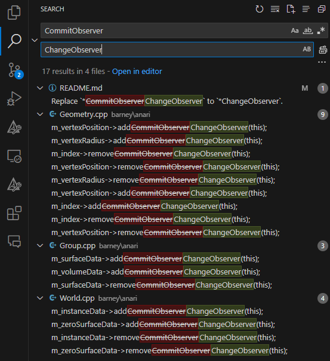

# Ascent + ANARI InSitu Visualization Integrations

Create a build directory:
```bash
ROOT=$PWD # or where you want to build
mkdir build
```

## Dependencies

On NVIDIA GPU, you need to install CUDA and [OptiX](https://developer.nvidia.com/rtx/ray-tracing/optix) 7+.

And export the path to OptiX:
```bash
export OptiX_INSTALL_DIR="/media/data/qadwu/Software/NVIDIA-OptiX-SDK-7.4.0-linux64-x86_64"
export CMAKE_PREFIX_PATH="/media/data/qadwu/Software/NVIDIA-OptiX-SDK-7.4.0-linux64-x86_64"
```
```powershell
$Env:OptiX_INSTALL_DIR = "C:\ProgramData\NVIDIA Corporation\OptiX SDK 7.4.0"
$Env:CMAKE_PREFIX_PATH = "C:\ProgramData\NVIDIA Corporation\OptiX SDK 7.4.0"
```

Then you can download BARNEY
```bash
cd <root-directory>
```
```bash
git clone --recursive https://github.com/ingowald/barney.git
```
Note that you need to manually replace `*ChangeObserver` with `*ChangeObserver`.
You can do this using VSCode or any text editor.




## Build Everything

```bash
cd <root-directory>
```

### Generate Build Files

Linux
```bash
cd build
cmake -S . -B build 
```

Windows (Powershell or Bash)
```bash
cd build
cmake -S . -B build -G "Visual Studio 17 2022" -A x64
```

### Actual Build

For all platforms:
```bash
cmake --build build --config Release --parallel
# cmake --build build --config Release --parallel --target anari-ospray
# cmake --build build --config Release --parallel --target anari-barney 
```

Outputs are installed into `build/install`.


### Tutorial 1: anariTutorialCpp

Linux:
```bash
cd build/anari/build
./anariTutorialCpp
```

Windows:
```powershell
cd build\anari\build\Release
.\anariTutorialCpp.exe
```


### Tutorial 2: anariViewer

Linux:

```bash
export LD_LIBRARY_PATH=/mnt/scratch/fast0/qadwu/anari-superbuild/build/install/lib:$LD_LIBRARY_PATH

cd build/anari/build
ANARI_LIBRARY=helide ./anariViewer 
ANARI_LIBRARY=ospray ./anariViewer # make sure libanari_library_ospray.so has been compiled
ANARI_LIBRARY=barney ./anariViewer # make sure libanari_library_barney.so has been compiled
```

Windows:

```powershell
$Env:PATH += ";E:\Projects\research\anari-superbuild\build\install\bin"
$Env:PATH += ";E:\Projects\research\anari-superbuild\build\install\redist\intel64\vc14"

cd build\anari\build\Release
$Env:ANARI_LIBRARY = "helide"
.\anariViewer 

# or ospray
$Env:ANARI_LIBRARY = "ospray"
.\anariViewer 

# or barney
$Env:ANARI_LIBRARY = "barney"
.\anariViewer 
```
